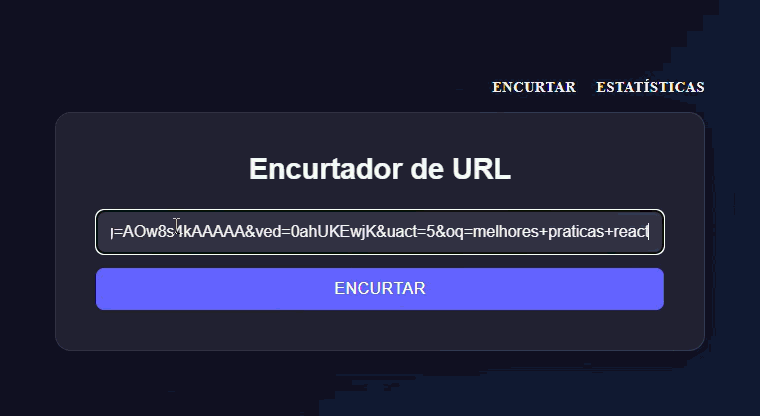

# 🔗 Encurtador de URL com Analytics

Aplicação full-stack para encurtar URLs e acompanhar estatísticas de cliques em tempo real, com dashboard visual.

## ✨ Funcionalidades

- Encurtar qualquer URL em um link curto único
- Redirecionamento automático ao acessar o link curto
- Registro de cada clique (data/hora)
- Dashboard com total de cliques e gráfico de histórico

## 🛠️ Tecnologias

**Back-end**
- Node.js + Express
- MySQL
- nanoid (geração de códigos únicos)

**Front-end**
- React + Vite
- React Router
- Recharts (gráficos)
- Axios

## 🚀 Como rodar localmente

### Pré-requisitos
- Node.js instalado
- MySQL instalado e rodando

### 1. Clone o repositório
\`\`\`bash
git clone https://github.com/SEU-USUARIO/encurtador-url.git
cd encurtador-url
\`\`\`

### 2. Configure o banco de dados
Rode o script SQL abaixo no seu MySQL:

\`\`\`sql
CREATE DATABASE encurtador_url;
USE encurtador_url;

CREATE TABLE links (
    id INT AUTO_INCREMENT PRIMARY KEY,
    codigo VARCHAR(10) NOT NULL UNIQUE,
    url_original TEXT NOT NULL,
    criado_em TIMESTAMP DEFAULT CURRENT_TIMESTAMP
);

CREATE TABLE cliques (
    id INT AUTO_INCREMENT PRIMARY KEY,
    link_id INT NOT NULL,
    clicado_em TIMESTAMP DEFAULT CURRENT_TIMESTAMP,
    ip_usuario VARCHAR(45),
    FOREIGN KEY (link_id) REFERENCES links(id)
);
\`\`\`

### 3. Configure o back-end
\`\`\`bash
cd backend
npm install
\`\`\`

Crie um arquivo \`.env\` na pasta \`backend\` com:
\`\`\`
DB_HOST=localhost
DB_USER=root
DB_PASSWORD=sua_senha
DB_NAME=encurtador_url
PORT=3001
\`\`\`

Inicie o servidor:
\`\`\`bash
node server.js
\`\`\`

### 4. Configure o front-end
Em outro terminal:
\`\`\`bash
cd frontend
npm install
npm run dev
\`\`\`

Acesse `http://localhost:5173`

## 📊 Estrutura do banco de dados

**Tabela `links`**: armazena o código curto e a URL original de cada link criado.

**Tabela `cliques`**: armazena cada clique registrado, associado a um link (chave estrangeira `link_id`).

## 🔮 Melhorias futuras

- Autenticação de usuários (cada um vê só seus próprios links)
- Expiração de links
- Testes automatizados

## 👤 Autor

Mateus Pistillo
[LinkedIn](www.linkedin.com/in/mateus-pistillo) · [GitHub](https://github.com/mateuspistillo)